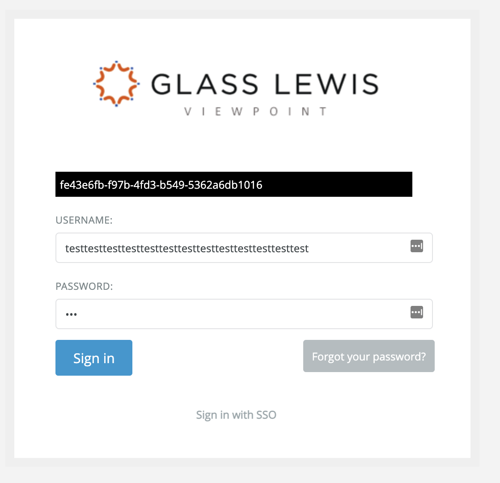

# Glass Lewis Code Challenge 2021

# Introduction

# Question 1 - Requirements (Answer)
## Description:
- As a user I want to reach out the http://www.glasslewis.com website, so I can use the website functionalities
- As a user I want to see the login button on the top right of the page, so I can log into the Viewpoint application
- As a user I want to see a smooth drop-down effect after hovering on the Login button, so I can decide which system do I want to log in
- As a user I want to arrive to the Viewpoint login page after clicking on the Login button, so I can log into the application
- As a user I want to log into the Viewpoint with the right credentials, so I can use the application
- As a user I want to get feedback in the case of wrong credentials, so I can identify why I can't log in

### Additional scenarios for the login page
- As a user I want to reset my password, so I can log into the application if I forgot my password
- As a user I want to see the 'Sign in with SSO' option on the Viewpoint login page, so I can log into the application with my SSO credentials

## Acceptance criteria:
### Functional
- The http://www.glasslewis.com website is available
- I can see the login button on the top right of the page
- I can hover over the login button and the login options appears
- On the Viewpoint login page I can log into the application with the right credentials
- On the Viewpoint login page I get back informative error message about why I can't log in
  - If the fields are empty: 'The fields USERNAME and PASSWORD are required.'
  - If the credentials are wrong: 'The fields USERNAME and PASSWORD are required.'
- On the Viewpoint login page I can reset my password with the 'Forgot your password?' button
- On the Viewpoint login page I can navigate forward with clicking on the 'Sign in with SSO' if I want to use SSO credentials for login

### Non-Functional
- The website loads within 5 second
- I can see a transition effect after hover over on the login button on the top right of the page
- I hover over the login button for Viewpoint and the button changes color from blue to orange
- On the Viewpoint login page I can see the "GlassLewis Viewpoint" picture
- The login functionality on the Viewpoint page is aligned in the middle
- On the Viewpoint login the 'Sign in' button is blue
- On the Viewpoint login the 'Forgot your password?' button is grey
- On the Viewpoint login the 'The fields USERNAME and PASSWORD are required.' message text color is white and the background color of the text is black
- On the Viewpoint login the 'Invalid username or password' message text color is white and the background color of the text is black

# Question 2 - Automation (Answer)

## Technology used
- Cypress
- JavaScript
- Pycharm (IDEA)
- Docker

## Prerequisite:

- Install nodejs and npm from the official website
- Install docker from the official website
  - pull down the latest cypress image
  ```commandline
  docker pull cypress/included:8.7.0  
  ```
  - This includes two browsers(Chrome and Firefox) and the most important dependencies
- With terminal go into the project folder and type
  - npm install --save-dev cypress 
    - This will create a sample project for cypress(I deleted the unused project files)
## How to run the project with different configuration

### How to run the project with Cypress
1.) Desktop application
- Download the cypress application from the official website
- Open the project with the application

2.) With npm and commandline
- With the terminal navigate into the project folder
- type the following, and it will open the cypress application:
```commandline
npx cypress run
```

### How to run the project with headless mode
- With the terminal navigate into the project folder and type:
```commandline
docker run -it -v $PWD:/e2e -w /e2e cypress/included:8.7.0
```

### How to run the project with Chrome
- With the terminal navigate into the project folder and type:
```commandline
docker run -it -v $PWD:/e2e -w /e2e cypress/included:8.7.0 --browser firefox
```

### How to run the project with Firefox
- With the terminal navigate into the project folder and type:
```commandline
docker run -it -v $PWD:/e2e -w /e2e cypress/included:8.7.0 --browser chrome
```

## How to run my project
- Download my project from github
- Prepare the system with the prerequisites(npm, docker, cypress)
- Run the test project with the application or from terminal as I advised above.

## Containerization
For this I am using Docker

- docker-compose.yml file in the project
  - In this file we can write configuration about how do we want to run our project
  - How to run a project with docker:
    - Go into the project folder and type:
    - ```commandline
       docker-compose up --exit-code-from cypress
      ```
    - This will mount the given docker file and start the project with the given configuration in the 'docker-compose.yml' file

### How to create docker image file
- With this functionality I can create my own docker image so everybody can run the same project on each machine 

How to create image with terminal:
- Go into he project folder
- Type the following command:
```commandline
docker build -t cypress-image-ig:1.1.0 .
```
- After starting the image, the test will run with given configuration

# Failures screenshot
Cypress automatically captures failures and put the screenshots under the screenshots folder and make videos about the failure as well.

This functionality is highly configurable. We can turn off or adjust the captured details in the cypress.json file.

# Environmental variables

This file could contain configuration setting, such as websites, etc.

Cypress will check My own cypress.env.json file, and it will overwrite conflicting environment variables in my configuration file (cypress.json by default).

Usually the cypress.env.json file should be in the .gitignore in order to avoid clashes. But for now for the sake of this demo and test I included

In this case the env file will overwrite the original cypress.json fule

The cypress.json contains this:
```json
{
  "env": {
    "DemoWebsite": "https://viewpoint.glasslewis.com/"
  },
  "screenshotOnRunFailure": false,
  "video": true
}
```
The cypress.env.json contains this:
```json
{
  "DemoWebsite": "https://viewpoint.glasslewis.com/WD/?siteId=DemoClient",
  "screenshotOnRunFailure": true,
  "video": false
}
```

# BUG
I get back 'fe43e6fb-f97b-4fd3-b549-5362a6db1016' error message if the username length is more than 50 character long
- Username:
  - testtesttesttesttesttesttesttesttesttesttesttesttest
- Password:
  - test

Screenshot:


- Solution: Set a hardcoded length for Username in the HTML code like this:
```HTML
<input name="Username" type="text" id="username" value="" class="loginCtrl" maxlength="10">
```